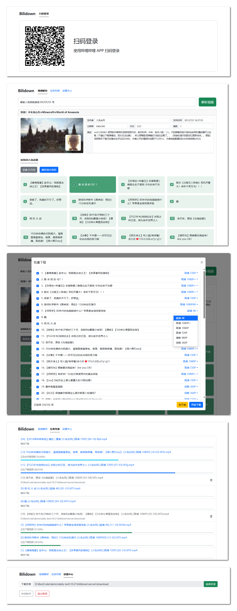

# Bilidown

哔哩哔哩视频解析下载工具，支持 8K 视频、Hi-Res 音频、杜比视界下载、批量解析，可扫码登录，常驻托盘。

## 使用说明

1. 从 [Releases](https://github.com/iuroc/bilidown/releases) 下载适合您系统版本的安装包
2. 非 Windows 系统，请先安装 [FFmpeg 工具](https://www.ffmpeg.org/)
3. 将安装包解压后执行即可

## 软件特色

1. 前端采用 [Bootstrap](https://github.com/twbs/bootstrap) 和 [VanJS](https://github.com/vanjs-org/van) 构建，轻量美观
2. 后端使用 Go 语言开发，数据库采用 SQlite，简化构建和部署过程
3. 前端通过 [p-queue](https://github.com/sindresorhus/p-queue) 控制并发请求，加快批量解析速度

## 其他说明

-   本程序不支持也不建议 HTTP 代理，直接使用国内网络访问能提升批量解析的成功率和稳定性。

## 打包可执行文件

```shell
git clone https://github.com/iuroc/bilidown
cd bilidown/client
pnpm install
pnpm build
cd ../server
go mod tidy
go build
```

## 交叉编译

### 说明

-   镜像名称：iuroc/cgo-cross-build
-   支持的系统架构
    -   `linux/amd64`
    -   `windows/amd64`
    -   `windows/386`
    -   `windows/arm64`
    -   `darwin/amd64`
    -   `darwin/arm64`

### 拉取镜像和项目源码

```shell
docker pull iuroc/cgo-cross-build:latest
git clone https://github.com/iuroc/bilidown
```

### 交叉编译发行版

```shell
cd bilidown/server
# [交叉编译 Releases]
docker run --rm -v .:/usr/src/data iuroc/cgo-cross-build goreleaser release --snapshot --clean
```

### 编译指定系统架构

```shell
cd bilidown/server

# [DEFAULT: linux-amd64]
docker run --rm -v .:/usr/src/data iuroc/cgo-cross-build go build -o dist/bilidown-linux-amd64/bilidown

# [darwin-amd64]
docker run --rm -v .:/usr/src/data -e GOOS=darwin -e GOARCH=amd64 -e CC=o64-clang -e CGO_ENABLED=1 iuroc/cgo-cross-build go build -o dist/bilidown-darwin-amd64/bilidown
```

## 特别感谢

-   [twbs/bootstrap](https://github.com/twbs/bootstrap) - 前端开发必备的响应式框架，简化页面布局
-   [vanjs-org/van](https://github.com/vanjs-org/van) - 轻量级的前端框架，专注于构建高效应用
-   [vitejs/vite](https://github.com/vitejs/vite) - 快速的前端构建工具，基于 ES 模块开发
-   [SocialSisterYi/bilibili-API-collec](https://github.com/SocialSisterYi/bilibili-API-collect) - B 站 API 集合，支持多种操作接口
-   [sindresorhus/p-queue](https://github.com/sindresorhus/p-queue) - 支持并发限制的 JavaScript 队列处理库
-   [iuroc/vanjs-router](https://github.com/iuroc/vanjs-router) - 轻量级前端路由工具，适用于 Van.js 框架
-   [uuidjs/uuid](https://www.npmjs.com/package/uuid) - 用于生成唯一标识符（UUID）的 JavaScript 库
-   [getlantern/systray](https://github.com/getlantern/systray) - 简单的跨平台系统托盘图标库，支持图标管理
-   [modernc.org/sqlite](https://pkg.go.dev/modernc.org/sqlite) - Go 语言的 SQLite3 数据库驱动，轻量高效
-   [skip2/go-qrcode](https://github.com/skip2/go-qrcode) - 生成 QR 码的 Go 语言库，简单易用

## 软件界面


