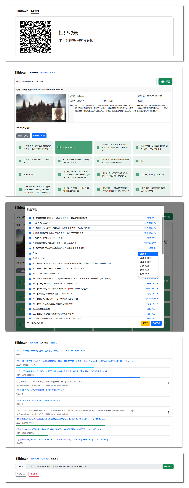

# Bilidown

[](https://github.com/iuroc/bilidown/releases)

Bilidown 是一个免费开源的哔哩哔哩视频下载工具：把视频链接粘贴进去，就能把视频保存到自己的电脑上。

- 支持 8K 超高清、Hi-Res 无损音质、杜比视界等规格
- 支持批量解析，一次下载整个合集或收藏夹
- 手机扫码即可登录，登录后可下载您账号有权观看的高清画质
- 双击运行，常驻系统托盘，随用随开
- 自动合并音视频，下载完成即可直接播放

## 它能下载什么

把下面这些类型的 B 站链接复制进来，都可以解析下载：

| 内容类型 | 链接示例 |
| --- | --- |
| 单个视频 | <https://www.bilibili.com/video/BV1LLDCYJEU3/> |
| 番剧 / 影视剧 | <https://www.bilibili.com/bangumi/play/ss48831> |
| 视频合集 | <https://space.bilibili.com/282565107/channel/collectiondetail?sid=1427135> |
| 收藏夹 | <https://space.bilibili.com/1176277996/favlist?fid=1234122612> |

> UP 主空间（一次下载某个 UP 的全部投稿）将在 3.x 版本支持。

## 下载安装

1. 打开 [Releases 发布页](https://github.com/iuroc/bilidown/releases)，在最新版本的 Assets 中，按自己的电脑系统下载对应的压缩包：

   | 我的电脑是…… | 下载这个 |
   | --- | --- |
   | Windows 10/11（64 位，绝大多数电脑） | `bilidown_Windows_x86_64.zip` |
   | Windows（32 位老电脑） | `bilidown_Windows_i386.zip` |
   | Windows ARM 笔记本 | `bilidown_Windows_arm64.zip` |
   | macOS（M1/M2/M3/M4 等 Apple 芯片） | `bilidown_Darwin_arm64.tar.gz` |
   | Linux（64 位） | `bilidown_Linux_x86_64.tar.gz` |

   > Windows 版已内置 FFmpeg，下载后无需再装任何东西。macOS 和 Linux 用户请见下方[常见问题](#常见问题)中的 FFmpeg 说明。

2. 把压缩包解压到一个固定的位置（例如 `D:\bilidown`，不要放在会被清理的临时目录里），因为下载的视频默认也保存在程序目录下。
3. 双击运行其中的 `bilidown` 程序（Windows 下是 `bilidown.exe`），浏览器会自动打开操作页面。

## 怎么使用

1. 在 B 站打开想下载的视频页面，复制浏览器地址栏里的链接。
2. 把链接粘贴到 Bilidown 页面的输入框中，点击解析。
3. 选择想要的画质，点击下载，等进度完成即可。
4. 想下载会员专享的高清画质？点击页面上的登录入口，用手机 B 站 App 扫码登录即可。

下载好的视频默认保存在程序目录的 `download` 文件夹里，也可以在页面的「设置」中修改保存位置。

## 常见问题

**双击运行后，什么窗口都没出现？**

本程序不会弹出传统窗口，而是常驻在系统托盘里（Windows 任务栏右下角，可能被收进了 `^` 折叠区），并自动用浏览器打开操作页面。如果浏览器没有自动打开，请手动在浏览器地址栏输入 `http://127.0.0.1:8098`。想退出程序：右键托盘图标 →「退出应用」。

**Windows 提示「已保护你的电脑」，或杀毒软件报毒？**

本软件没有购买数字签名（签名证书需要按年付费），所以 Windows 会显示这个提示，属于正常现象。点击「更多信息」→「仍要运行」即可。如果被杀毒软件拦截，在杀毒软件里添加信任即可。

**macOS 提示「已损坏，无法打开」或「无法验证开发者」？**

这是因为程序未经苹果公证。打开「终端」，进入解压后的目录，执行下面的命令后再打开：

```shell
xattr -cr bilidown
```

**提示缺少 FFmpeg，或双击后完全没有反应？（macOS / Linux）**

Windows 版已内置 FFmpeg，一般不会遇到此问题。macOS 和 Linux 需要自行安装 FFmpeg：

- macOS：安装 [Homebrew](https://brew.sh/) 后，在终端执行 `brew install ffmpeg`
- Linux（Debian / Ubuntu）：`sudo apt install ffmpeg`

也可以从 [FFmpeg 官网](https://www.ffmpeg.org/download.html)下载后，放入程序所在目录的 `bin` 文件夹内。

**提示端口 8098 被占用？**

本程序固定使用 8098 端口通信。请关闭电脑上其他占用该端口的程序，然后重新打开 Bilidown。

**解析失败，或批量下载经常中途失败？**

B 站对高频请求有限制。请不要使用代理、加速器，直连国内网络能明显提升成功率；批量下载大量视频时请耐心等待，程序会自动排队逐个处理。

## 软件界面



## 特别感谢

- [twbs/bootstrap](https://github.com/twbs/bootstrap) - 前端开发必备的响应式框架，简化页面布局
- [vanjs-org/van](https://github.com/vanjs-org/van) - 轻量级的前端框架，专注于构建高效应用
- [vitejs/vite](https://github.com/vitejs/vite) - 快速的前端构建工具，基于 ES 模块开发
- [SocialSisterYi/bilibili-API-collec](https://github.com/SocialSisterYi/bilibili-API-collect) - B 站 API 集合，支持多种操作接口
- [sindresorhus/p-queue](https://github.com/sindresorhus/p-queue) - 支持并发限制的 JavaScript 队列处理库
- [iuroc/vanjs-router](https://github.com/iuroc/vanjs-router) - 轻量级前端路由工具，适用于 Van.js 框架
- [uuidjs/uuid](https://www.npmjs.com/package/uuid) - 用于生成唯一标识符（UUID）的 JavaScript 库
- [getlantern/systray](https://github.com/getlantern/systray) - 简单的跨平台系统托盘图标库，支持图标管理
- [modernc.org/sqlite](https://pkg.go.dev/modernc.org/sqlite) - Go 语言的 SQLite3 数据库驱动，轻量高效
- [skip2/go-qrcode](https://github.com/skip2/go-qrcode) - 生成 QR 码的 Go 语言库，简单易用

## Star History

[](https://www.star-history.com/#iuroc/bilidown&Date)

## 参与开发

本项目后端使用 Go，前端使用 Vite + VanJS + Bootstrap 构建。想参与开发或了解项目结构与运行方式，请阅读 [AGENTS.md](./AGENTS.md)。
